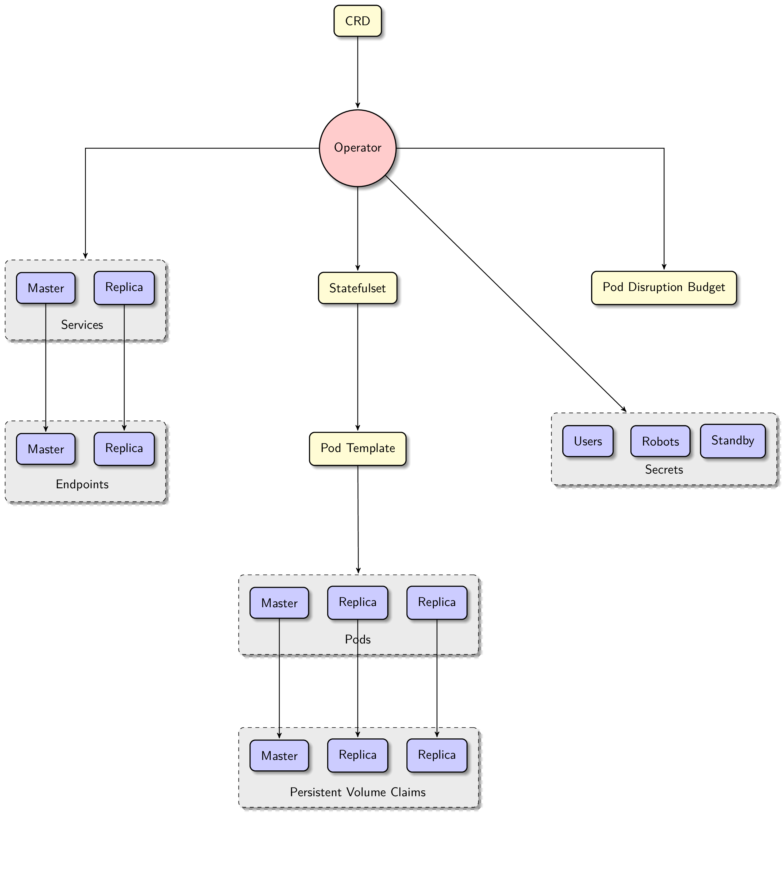

# Architecture

Reference Document: [Zalando Postgres Operator Official Documentation](https://opensource.zalando.com/postgres-operator/docs/)

The PostgreSQL Operator manages PostgreSQL clusters using the Kubernetes Operator pattern, primarily consisting of the following core components:

## Core Components

1. **Operator Controller**
   - Listens to changes in PostgreSQL Custom Resource Definitions (CRD)
   - Responsible for cluster creation, scaling, configuration updates, and other operations
   - Manages the lifecycle of the cluster

2. **Patroni**
   - Provides high availability guarantees
   - Handles primary and standby switching and failover
   - Manages cluster topology and member status

3. **Spilo**
   - Provides the PostgreSQL container image
   - Integrates Patroni and PostgreSQL
   - Handles initialization configuration and startup

4. **Monitoring Component**
   - Integrates Prometheus for metrics collection
   - Provides Grafana dashboards
   - Supports alert rule configuration

## Data Flow

1. Users create PostgreSQL Custom Resource through the Kubernetes API
2. The Operator Controller listens for resource changes and creates the related Kubernetes resources
3. Patroni is responsible for the initialization and high availability management of the cluster
4. Spilo starts the PostgreSQL instance and applies the configuration
5. The monitoring component collects metrics and displays them

## Modes

The PostgreSQL Operator supports the following deployment modes:

- **Single Cluster Mode**: Runs in a single Kubernetes cluster
- **Multi-Cluster Mode**: Manages PostgreSQL instances across multiple Kubernetes clusters
- **High Availability Mode**: Achieves automatic failover through Patroni
