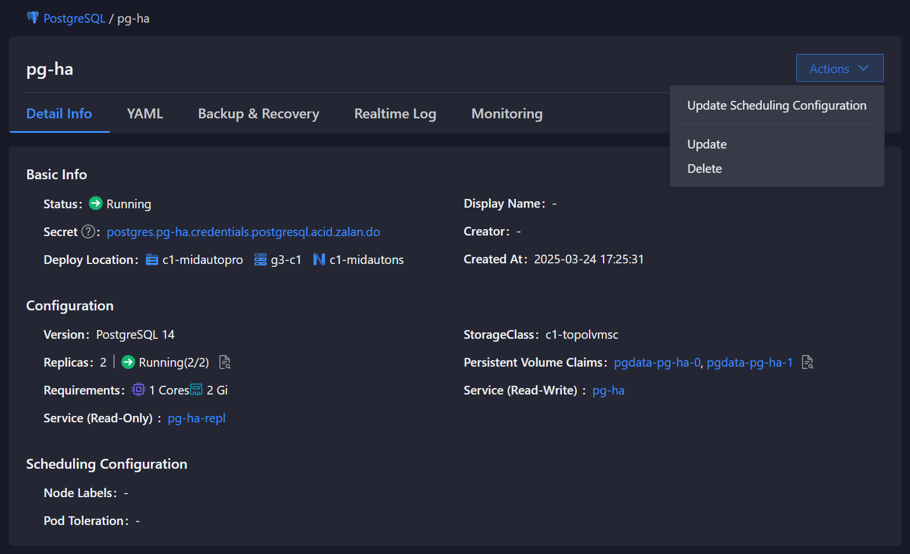

# Deleting a PostgreSQL Instance

:::warning
**Important Considerations Before Deletion**
- This operation is **irreversible** - deleted instances cannot be recovered
- Ensure you have [valid backups](../functions/15_back_restore.mdx) if you might need the data later
- Verify no applications are currently using this database instance
- Cluster deletion will remove all replicas and associated resources
:::

Deleting a PostgreSQL instance will remove:
- The Custom Resource (CR) 
- StatefulSet and Pods
- ConfigMaps and Secrets  
- PersistentVolumeClaims (PVCs)
- Monitoring and logging resources

## Steps to Operate

<Tabs>
  <Tab label="CLI">
    To delete a PostgreSQL instance (including all associated PVCs), execute:

    ```bash
    kubectl -n $NAMESPACE delete postgresql <instance-name>
    ```

    Example output:
    ```bash
    postgresql.acid.zalan.do "example-postgres" deleted
    ```

    After deletion, you can confirm the instance status with:

    ```bash
    kubectl -n $NAMESPACE get postgresql
    ```
  </Tab>

  <Tab label="Web Console">

    1. Navigate to **PostgreSQL** in the left menu
    2. Select the target namespace.
    3. Choose the instance you wish to delete from the instance list.
    4. On the instance details page, click the **Actions** button in the upper-right corner.
    
    
    
    5. Select the **Delete** option.
    6. Confirm deletion of the instance and all its data.
    7. Enter the instance name in the confirmation box.
    8. Click **Delete**.
  </Tab>
</Tabs>

## Post-Deletion Verification

After deletion, verify all resources are removed:

```bash
kubectl -n default get postgresql  # Should not show deleted instance
kubectl -n $NAMESPACE get pvc  # Verify PVCs were deleted
```

## Related Operations

- [Creating Backups](../functions/15_back_restore.mdx)
- [Monitoring Deletion Progress](../functions/35_monitor.mdx)
- [Troubleshooting Deletion Issues](../trouble_shooting/cluster_creation_failure.mdx)
