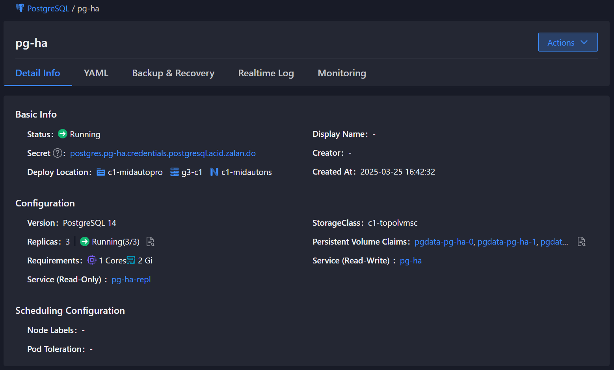

# Instance Details

## Feature Overview

View detailed information about the PostgreSQL instance, including:

- Basic information and status of the instance
- Database connection information
- Resource configuration and storage information
- Scheduling configuration
- Related Kubernetes resources

## Notes

1. Viewing Secrets requires the appropriate Kubernetes RBAC permissions.
2. The information displayed on the instance detail page comes from the Kubernetes CRD and the actual running status.
3. Some configuration information cannot be modified after the instance is created.

## Operation Steps

<Tabs>
  <Tab label="CLI">
    ### View Basic Instance Information

    ```bash
    kubectl -n <namespace> get postgresql <instance_name> -o yaml
    ```

    ### View Database Connection Information

    ```bash
    # View PostgreSQL user password
    kubectl -n <namespace> get secret <instance_name>.credentials.postgresql.acid.zalan.do -o yaml

    # View connection endpoint
    kubectl -n <namespace> get svc <instance_name>
    ```

    ### View Resource Configuration

    ```bash
    # View Pod resource limits
    kubectl -n <namespace> get pod <instance_name>-0 -o yaml | grep resources -A 5

    # View storage configuration
    kubectl -n <namespace> get pvc pgdata-<instance_name>-0 -o yaml
    ```

    ### View Scheduling Configuration

    ```bash
    # View node affinity
    kubectl -n <namespace> get postgresql <instance_name> -o yaml | grep affinity -A 10

    # View tolerations
    kubectl -n <namespace> get postgresql <instance_name> -o yaml | grep tolerations -A 5
    ```
  </Tab>

  <Tab label="Web Console">
    1. Click **PostgreSQL** in the left navigation bar.
    2. Select the target namespace.
    3. Choose the instance you wish to view from the instance list to enter the instance detail page.

    

    The instance detail page contains the following information:

    ### Basic Information

    - Status: Current running state of the instance
    - Secret Dictionary: Kubernetes Secret containing the database user password
    - Deployment Location: Kubernetes node where the instance is deployed
    - Display Name: Human-readable name of the instance
    - Creator: Creator of the instance
    - Creation Time: Creation time of the instance

    ### Configuration Information

    - Database Version: Version of PostgreSQL
    - Replica Count: Number of replicas currently running
    - Specifications: CPU and memory resource configuration
    - Internal Routing: ClusterIP for read-write and read-only services
    - Storage Class: Storage class used
    - Persistent Volume Claim: PVC storing the data

    ### Scheduling Configuration

    - Node Labels: Node label requirements for instance scheduling
    - Pod Tolerations: Toleration configuration for instance Pods
  </Tab>
</Tabs>

## Learn More

- [PostgreSQL Operator Architecture](../architecture.mdx)
- [Instance Creation Guide](./01_create_instance.mdx)
- [Instance Deletion Guide](./02_delete_instance.mdx)
