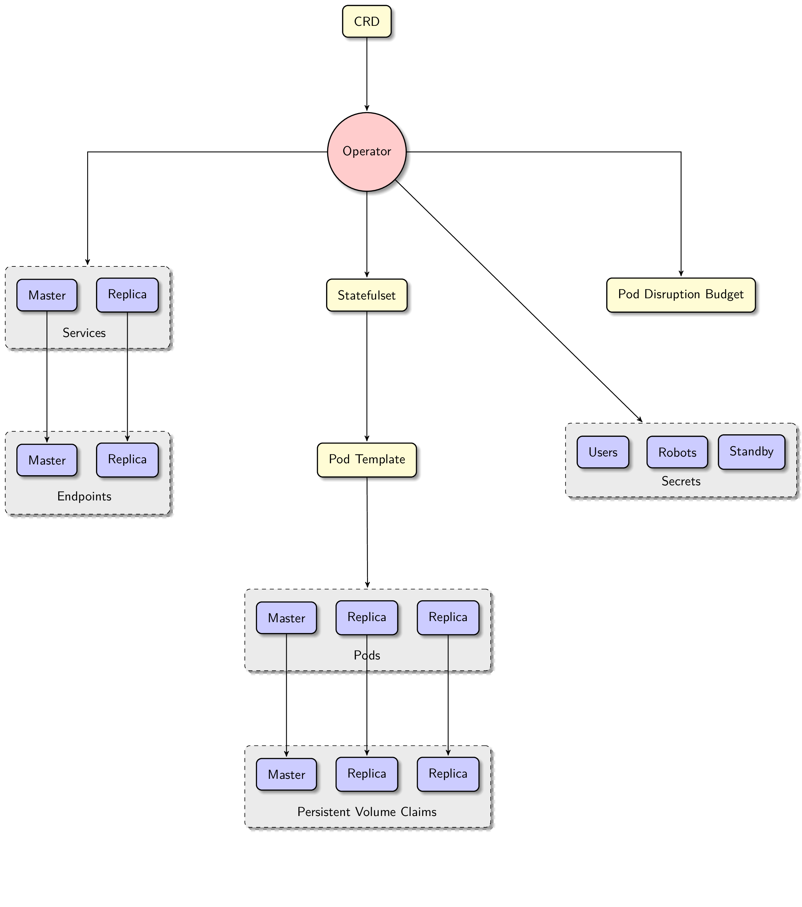

# 架构

参考文档：[Zalando Postgres Operator 官方文档](https://opensource.zalando.com/postgres-operator/docs/)

PostgreSQL Operator 采用 Kubernetes Operator 模式管理 PostgreSQL 集群，主要包含以下核心组件：

## 核心组件

1. **Operator 控制器**
   - 监听 PostgreSQL 自定义资源（CRD）的变化
   - 负责集群的创建、扩缩容、配置更新等操作
   - 管理集群的生命周期

2. **Patroni**
   - 提供高可用性保障
   - 处理主从切换和故障转移
   - 管理集群拓扑和成员状态

3. **Spilo**
   - 提供 PostgreSQL 容器镜像
   - 集成 Patroni 和 PostgreSQL
   - 处理初始化配置和启动

4. **pgBouncer**
   - 提供连接池功能
   - 优化数据库连接管理
   - 支持读写分离

5. **监控组件**
   - 集成 Prometheus 指标收集
   - 提供 Grafana 仪表盘
   - 支持告警规则配置

## 数据流程

1. 用户通过 Kubernetes API 创建 PostgreSQL 自定义资源
2. Operator 控制器监听资源变化并创建相关 Kubernetes 资源
3. Patroni 负责集群的初始化和高可用管理
4. Spilo 启动 PostgreSQL 实例并应用配置
5. pgBouncer 提供连接池服务
6. 监控组件收集指标并展示

## 部署架构

PostgreSQL Operator 支持以下部署模式：

- **单集群模式**：在单个 Kubernetes 集群中运行
- **多集群模式**：跨多个 Kubernetes 集群管理 PostgreSQL 实例
- **高可用模式**：通过 Patroni 实现自动故障转移
