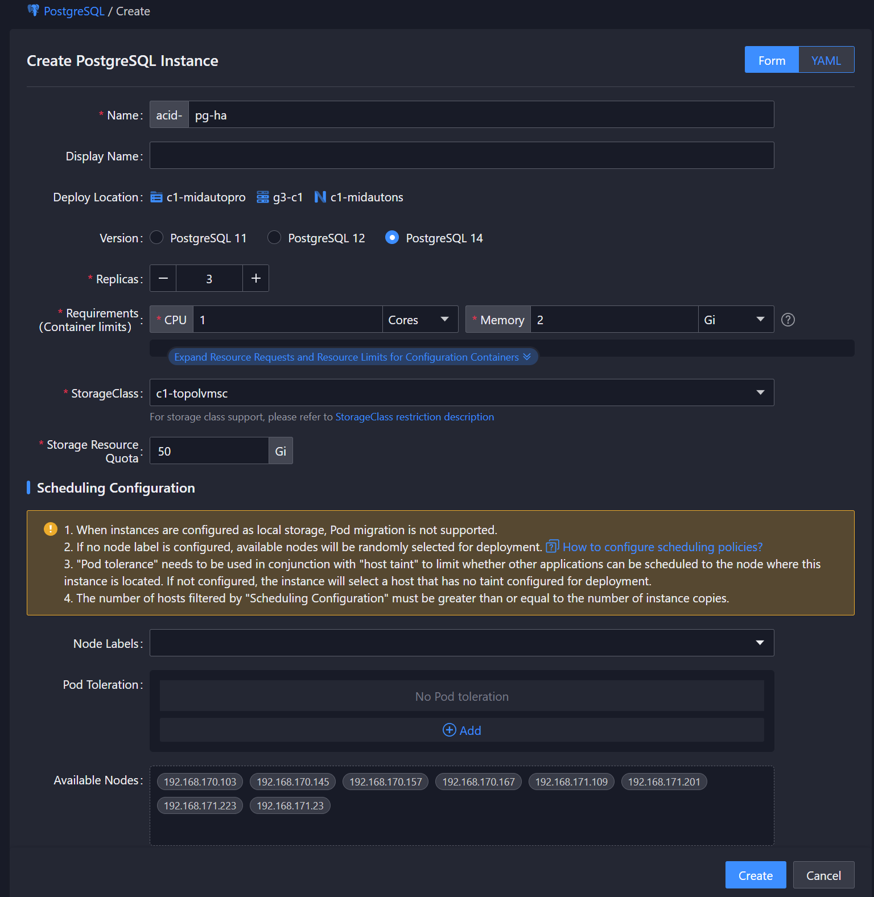

# 创建实例 {#create-instance}

## 功能简介
本功能用于在 Kubernetes 集群中创建和管理 PostgreSQL 数据库实例。用户可以通过配置以下内容快速部署符合需求的数据库实例：

- 资源规格
- 账户信息
- 存储需求

## 前提条件
在创建 PostgreSQL 实例之前，请确保：
1. 已配置合适的存储类
2. Postgres Operator 已正确安装并运行
3. 具有创建资源的权限

## 版本支持
当前支持 PostgreSQL 11,12,14 版本，建议使用最新稳定版本。

## 架构选择 {#architecture-choices}
Postgres Operator 支持以下架构：

- **单节点**：适用于开发测试环境
- **主从复制**：生产环境推荐架构，支持：
  - 自动故障转移
  - 高可用性
  - 数据冗余

## 操作步骤
<Tabs>
<Tab label="CLI">

### 创建单节点实例
```yaml
# 最小化 HA 集群配置示例
cat << EOF | kubectl create -f -
apiVersion: acid.zalan.do/v1
kind: postgresql  # PostgreSQL 集群的自定义资源定义
metadata:
  name: pg-single
  namespace: c1-midautons
spec:
  ipFamilyPrefer: ""
  teamId: ACID
  enableExporter: true
  enablePgpool2: false
  spiloPrivileged: false
  spiloRunAsGroup: 103
  spiloRunAsUser: 101
  spiloAllowPrivilegeEscalation: false
  enableReadinessProbe: true
  postgresql:
    parameters:
      log_directory: /var/log/pg_log
    version: "14"
  numberOfInstances: 1
  resources:
    requests:
      cpu: "1"
      memory: 2Gi
    limits:
      cpu: "1"
      memory: 2Gi
  volume:
    size: 5Gi
    storageClass: c1-topolvmsc
EOF
```

### 创建高可用集群
```bash
cat << EOF | kubectl -n $NAMESPACE create -f -
apiVersion: acid.zalan.do/v1
kind: postgresql
metadata:
  name: pg-ha
  namespace: default
spec:
  ipFamilyPrefer: ""
  teamId: ACID
  enableExporter: true
  enablePgpool2: false
  spiloPrivileged: false
  spiloRunAsGroup: 103
  spiloRunAsUser: 101
  spiloAllowPrivilegeEscalation: false
  enableReadinessProbe: true
  postgresql:
    parameters:
      log_directory: /var/log/pg_log
    version: "14"
  numberOfInstances: 3
  resources:
    requests:
      cpu: "1"
      memory: 2Gi
    limits:
      cpu: "1"
      memory: 2Gi
  volume:
    size: 50Gi
    storageClass: default
  patroni:
    ttl: 30
    loop_wait: 10
    retry_timeout: 10
EOF
```

创建后可通过以下命令查看实例状态：
```bash
kubectl -n $NAMESPACE get postgresql
```

预期输出：
```bash
NAME                            AGE
pg-ha                           21h
```

输出字段说明：
| 字段   | 说明                     |
| ------- | ------------------------------ |
| NAME    | 实例名称                  |
| AGE     | 创建时间            |

</Tab>

<Tab label="Web Console">

1. 在左侧导航栏中，单击 **PostgreSQL**
2. 选择目标命名空间
3. 单击 **创建 PostgreSQL 实例**
4. 配置以下参数：

<table border="">
  <tr>
    <th>配置项</th>
    <th>说明</th>
  </tr>
  <tr>
    <td>实例名称</td>
    <td>集群的唯一标识</td>
  </tr>
  <tr>
    <td>PostgreSQL 版本</td>
    <td>选择支持的 PostgreSQL 版本</td>
  </tr>
  <tr>
    <td>副本数</td>
    <td>设置集群节点数量</td>
  </tr>
  <tr>
    <td>规格（容器限制值）</td>
    <td>设置 CPU 和内存资源限制</td>
  </tr>
  <tr>
    <td>存储类</td>
    <td>设置存储类</td>
  </tr>
  <tr>
    <td>存储配额</td>
    <td>设置存储类及存储大小</td>
  </tr>
</table>

5. 单击 **创建**，等待实例状态变为 **运行中**

</Tab>
</Tabs>

    

> **注意**
> 
> 1. 生产环境建议使用[主从复制架构](#architecture-choices)
> 2. 部署前请确保存储类支持动态供给
> 3. 合理配置[资源限制](https://kubernetes.io/docs/concepts/configuration/manage-resources-containers/)
> 4. 对重要数据实施定期备份

> **警告**
> 
> - 不合理的资源限制可能导致性能问题或 Pod 被驱逐
> - 没有备份的情况下，故障时可能导致数据丢失
