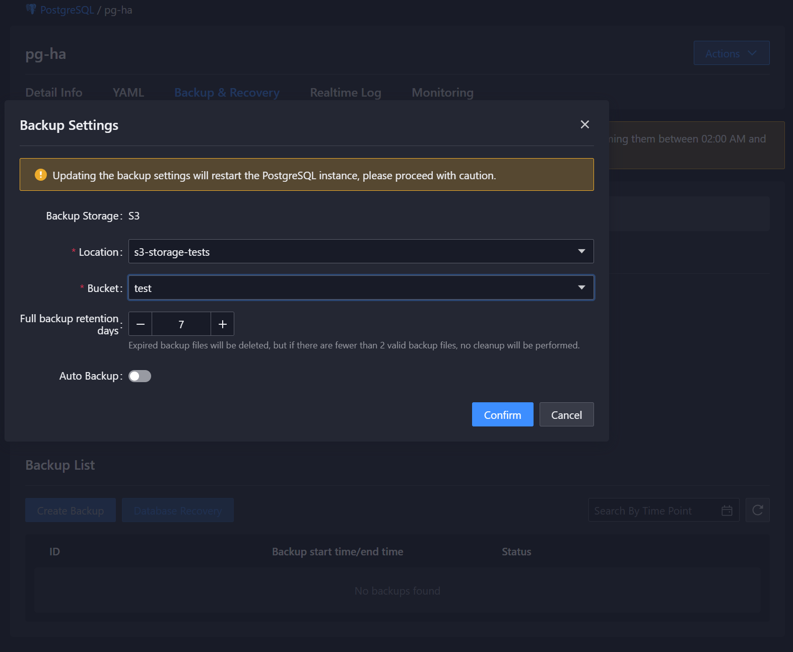
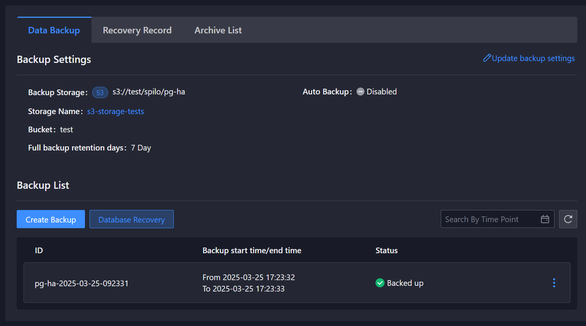
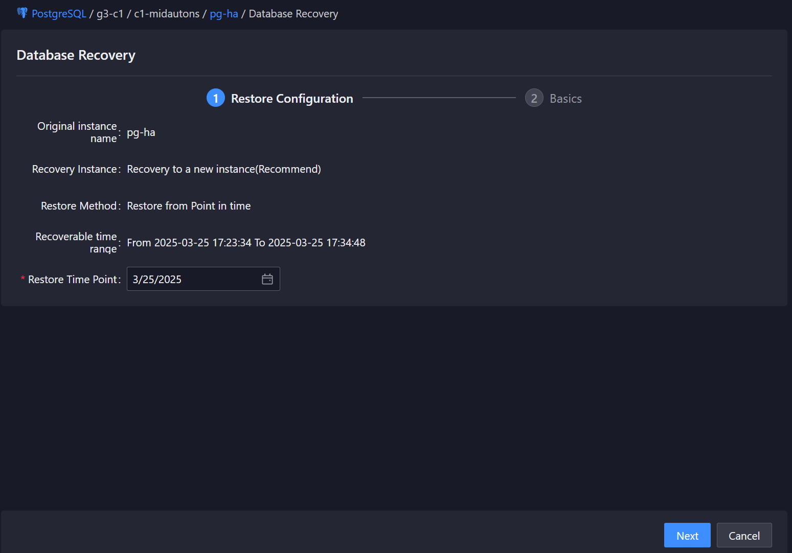

# 备份恢复

## 功能介绍
提供基于存储的物理备份和恢复功能，保障数据安全。支持手动触发备份和恢复到新实例。

## 操作步骤
<Tabs>
  <Tab label="CLI">

### 配置备份存储
    

```bash
# 示例：为实例'my-pg-instance'配置备份存储
kubectl patch postgresql my-pg-instance -n my-namespace --type='merge' -p '
spec:
  backup:
    retainDay: 7
    storage:
      name: my-s3-config
      bucket: my-backup-bucket
      namespace: storage-namespace
'
```

### 创建备份
```bash
# 示例：为集群'my-pg-cluster'创建名为'my-backup'的备份
cat <<EOF | kubectl create -f -
apiVersion: middleware.alauda.io/v1
kind: PostgresBackup
metadata:
  name: my-backup
  namespace: my-namespace
spec:
  cluster: my-pg-cluster
  executeNode: my-pg-cluster-0  # 可选：指定执行备份的pod
EOF
```

### 查看备份状态
```bash
kubectl get postgresbackup <备份名称> -n <命名空间> -o yaml
```

### 恢复数据库
```bash
cat <<EOF | kubectl create -f -
apiVersion: middleware.alauda.io/v1
kind: PostgresRestore
metadata:
  name: <恢复实例名称>
  namespace: <命名空间>
spec:
  backupCluster:
    name: <备份PG集群实例名>
    uid: <备份PG集群UID>
    storage:
      name: <存储名>
      namespace: <存储命名空间>
      bucket: <S3 bucket名>
  targetCluster: |
    apiVersion: acid.zalan.do/v1
    kind: postgresql
    metadata:
      name: <新群实例名称>
      namespace: <新集群实例名称>
    spec:
      enableExporter: true
      enablePgpool2: false
      numberOfInstances: 2
      postgresql:
        version: "14"
      resources:
        limits:
          cpu: "1"
          memory: 2Gi
        requests:
          cpu: "1"
          memory: 2Gi
      teamId: ACID
      volume:
        size: 20Gi
        storageClass: sc-topolvm
  timestamp: "2023-07-26T14:36:38+00:00"  # 恢复的时间点
EOF
```

</Tab>

<Tab label="Web Console">

1. 在左侧导航栏中，单击 **PostgreSQL**
2. 选择目标命名空间
3. 在实例列表中选择目标实例
4. 点击**备份恢复**Tab页

### 配置备份存储
1. 点击**配置存储**按钮
2. 填写存储配置信息：
   - 存储配置名称
   - 存储桶名称
   - 存储配置命名空间
   - 备份保留天数
3. 点击**保存**

### 创建备份
    


1. 点击**创建备份**按钮
2. 弹出窗口将显示：
   - 实例名称（预填充，例如 pg-ha）
   - 类型：基础备份（完整备份）
3. 点击**创建**开始备份或点击**取消**中止

备份完成后，备份将出现在列表中，包含：
- ID: pg-ha-2025-03-25-092331
- 备份开始/结束时间：从 2025-03-25 17:23:32 到 2025-03-25 17:23:33
- 状态：已备份

### 查看备份状态
1. 在备份列表中选择目标备份
2. 查看备份状态信息：
   - 备份时间
   - 备份大小
   - 备份状态
   - 执行节点

### 恢复数据库
    


1. 点击**恢复数据库**按钮
2. 恢复配置页面将加载，包含：
   - 原始实例名称（预填充，例如 pg-ha）
   - 恢复实例：恢复到新实例（推荐）
   - 恢复方法：从时间点恢复
   - 可恢复时间范围（例如 从 2025-03-25 17:23:34 到 2025-03-25 17:34:48）
   - 恢复时间点（可选）
3. 点击**下一步**继续

4. 在基础配置页面：
   - 输入名称（必须以字母开头，以字母/数字结尾，仅包含小写字母、数字和"-"，最多30个字符）
   - 输入显示名称
   - 选择部署位置
   - 选择 PostgreSQL 版本（例如 11, 12, 14）
   - 设置副本数量（例如 3）
   - 配置资源需求：
     - CPU（例如 1 核）
     - 内存（例如 2 Gi）
   - 选择 StorageClass（例如 c1-topolvmsc）
   - 设置存储资源配额（例如 50 Gi）
   - 配置调度选项
5. 点击**恢复**开始过程
6. 您将被重定向到新实例的详情页面

</Tab>
</Tabs>

## 备份状态说明
备份状态字段说明：

| 字段 | 说明 |
|------|------|
| backupName | 备份文件名称 |
| clusterUid | 集群唯一标识 |
| configBackupStorage | 备份存储配置 |
| executeNode | 执行备份的节点 |
| finishLsn | 备份结束的LSN位置 |
| finishTime | 备份完成时间 |
| lastModified | 备份最后修改时间 |
| pgVersion | PostgreSQL版本 |
| startLsn | 备份开始的LSN位置 |
| startTime | 备份开始时间 |
| state | 备份状态 |

## 注意事项
1. 备份存储配置需要在创建备份前完成
2. 恢复操作会创建新的PostgreSQL实例
3. 备份保留天数到期后会自动删除
4. 恢复过程中请勿对源集群进行写操作
5. 确保目标集群的存储类与源集群兼容
6. 在启动备份前验证有足够的存储空间
7. 定期测试恢复流程以确保备份有效性
8. 对于敏感数据，考虑启用备份加密
